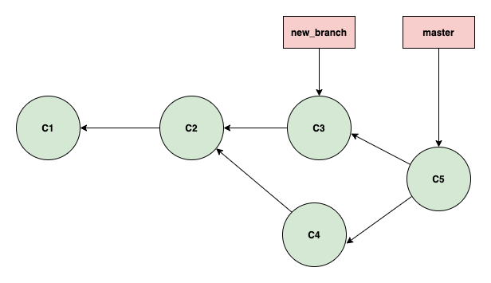

This file contains write downs about my findings on how git works internaly and sources which I used to read up on git internals. I am using it as a write up. If there is anything wrong, feel free to open an issue so that I can improve it and gain a better understanding :)

# Git

# .git Folder
```
 .git
  |--> objects                 contains data for each commit
  |--> refs
  |    |--> heads
  |    |    |--> master        file containing current commit of local master branch
  |    |--> remotes
  |    |    |--> origin
  |    |    |    |--> master   file containing current commit of remote origin's master branch 
  |--> FETCH-HEAD              file updated by git fetch, contains info of what was fetched
```
## Git Add


Add file to index and create an object out of it. Store the object in `.git/objects/hash[0:2]/hash[2:]`
Files are stored as blobs
To get the structure, check the python code
The blob structure is

Blob object has the following structure
```
zlib.compress('blob [content size]\0content')
```

## Git Commit

Create a tree object and create a commit object

Tree object has the following structure:
```
zlib.compress('tree [content size]\0[Object Entries]')
```
where object entries are: 
```
[mode] [Object name]\0[SHA-1 in binary format]
```
Mode: 
 - o100644 - it’s a normal file
 - o100755 - it’s an executable file
 - o120000 - it's a symbolic link
 - o40000  - it's a tree object

Commit object has the following structure:
```
zlib.compress('commit [content size]\0[content]')
```
where `content`:
```
tree [tree_sha]
[parents]
author [author_name] <[author_email]> [author_date_seconds] [author_date_timezone]
committer [committer_name] <[committer_email]> [committer_date_seconds] [committer_date_timezone]

[commit message]
```
where:

  - `tree_sha` - SHA of the tree object this commit points to. This represents the top-level Git repo directory. That SHA comes from the format of the tree object.
  - `parents` - optional list of parent commit objects of form:
    ```
	parent {parent1_sha}
	parent {parent2_sha}
	...
	```
	The list can be empty if there are no parents, e.g. for the first commit in a repo. Two parents happen in regular merge commits. More than two parents are possible with git merge -Xoctopus, but this is not a common workflow. Here is an example: https://github.com/cirosantilli/test-octopus-100k
  - `author_name`: Name of user who wrote commit message. Cannot contain <, \n
  - `author_email`: Email of author. Cannot contain >, \n
  - `author_date_seconds`: seconds since 1970, e.g. 946684800 is the first second of year 2000
  - `author_date_timezone`: e.g.: +0000 is UTC
  - `committer fields`: analogous to author fields
  - `commit message`: arbitrary.

## Algorithm to create commit object with subdirectories

Let's consider I am having the following directory structure:
```
|
|-test.txt
|-testFolder
  |-test.txt
|-helloWorld
  |-test.txt
```
In the first step I am creating a mapping of files and directories in the following way:
```
{
	'.'         : [test.txt, testFolder, helloWorld],
	'testFolder': [test.txt],
	'helloWorld': [test.txt]
}
```
Once I have this structure, I am iterating over the git root folder, which is `.` and for every file I am creating a blob object. If I hit a directory name, I have to create a new tree object. I am doing this recursive.

In case of testFolder, I would call `__write_subtree` where I iterate over the files in `testFolder` and return a tree object. The same happens with `helloWorld`. This also allows to traverse subdirectories :)

## Branches

Branches are done using refs. In `.git/refs/heads/[branch name]` you have a pointer to a hash the `HEAD` file is pointing to the file. If we are on master the content of HEAD is
HEAD
```
ref: refs/head/master
```
In case we are on a branch called test, the content of HEAD is
```
ref: refs/head/test
```

## Usefull commands
You is a usefull terminal command to read internal git objects:
```
python2 -c "import zlib,sys;sys.stdout.write(zlib.decompress(sys.stdin.read()))"   <.git/objects/9a/1462e447d986840ba13ce87e8b22160e74e099 | hd
```

# Git Fetch

 * downloads all remote commits, trees and blobs
 * writes the sha1 hash of the remote tip into .git/FETCH_HEAD
   The exact entry is: `sha1    branch 'master' of url`

# Git Merge
## Fast-Forward
We have a master branch and create a new branch. There we add a new file, add it and commit it. Next, we are going to merge the new 
branch into the master branch. Since we have not performed any new commit on the master branch after creating the new branch, our
branches are not diverged and master just started pointing to the commit where the new branch is currently poining to.
[3]

## Non Fast Forward Merge
Here we are going to explain how non fast forward merge, also true merge or 3way merge called, works.
We are now in the following situation:
[3]

The branches diverged. 

If we merge the new branch into the master branch, we will get a new commit, which has two parents:
[3]

But how are the files merged?

Merge commits points to a new tree which is created using recursive merge strategy (default merge strategy for no fast forward merge), which in turn points to older tree and blobs or new blobs created during merge process.
Incase of any merge conflicts that are resolved are under vicinity of tree associated with merge commit. Below is complete git tree diagram showing merge commit.

One more thing which generally creates confusion among developers is how in git merge same file edits handled in different branches? During merge process the git merges the file snapshot line by line and creates new blob snapshot automatically unless it finds a conflict.
Conflict happens if during merge process edit/diffs are found on same line in the same file. When you resolve the conflict the blob associated with new edits is referenced in merge commit tree.


# Sources
  [1] http://jwiegley.github.io/git-from-the-bottom-up/

  [2] http://shafiul.github.io/gitbook/1_the_git_object_model.html

  [3] https://medium.com/@paritosh90/git-internals-merge-2fe923d0c0c6

  [4] 3-way merge:  https://www.mercurial-scm.org/pipermail/mercurial-devel/2006-November/000322.html
